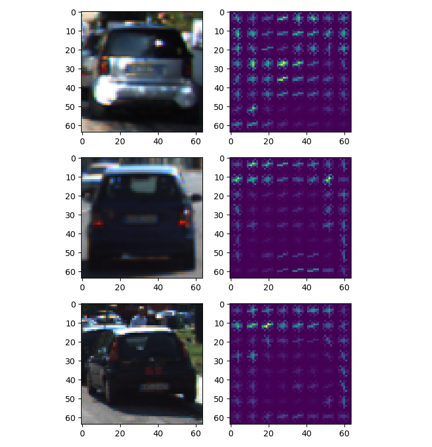
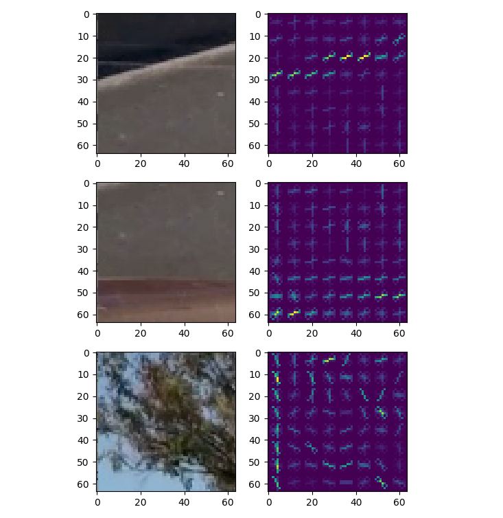
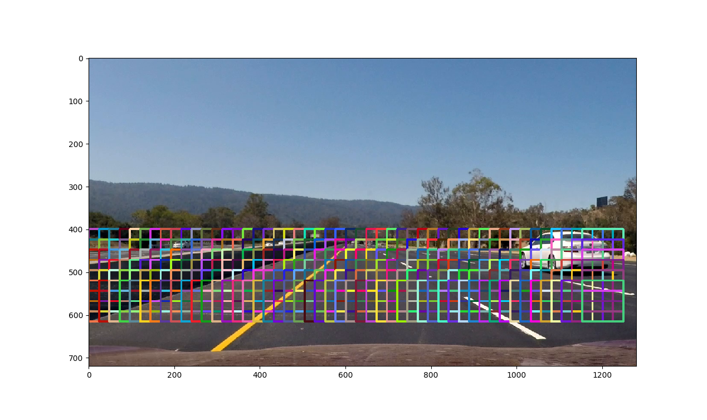
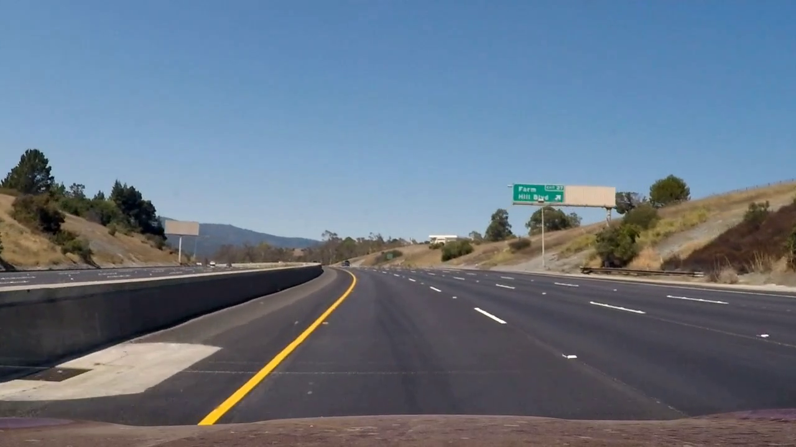
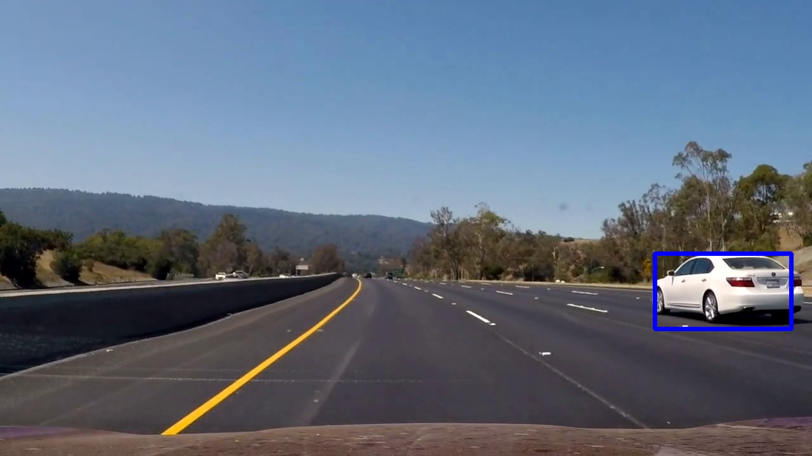
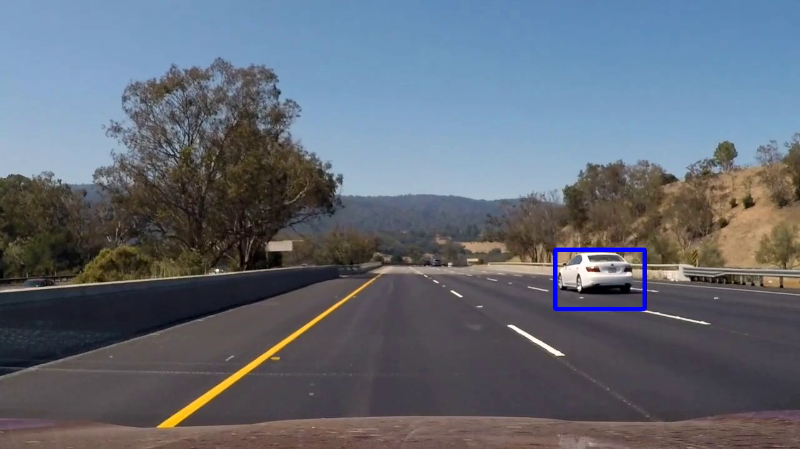
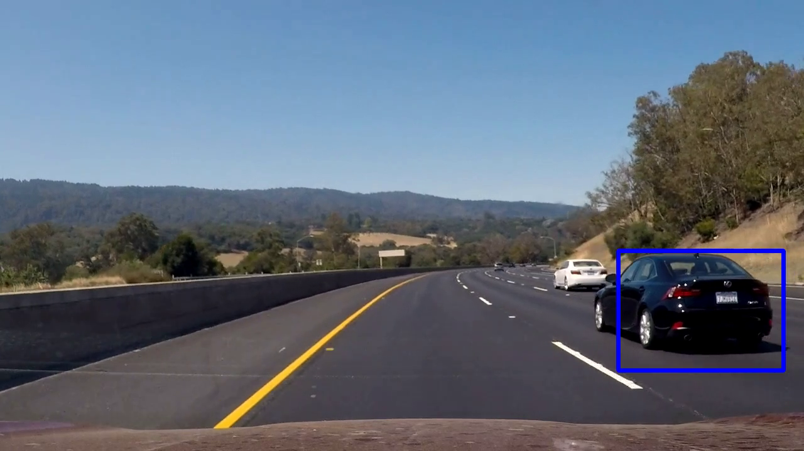
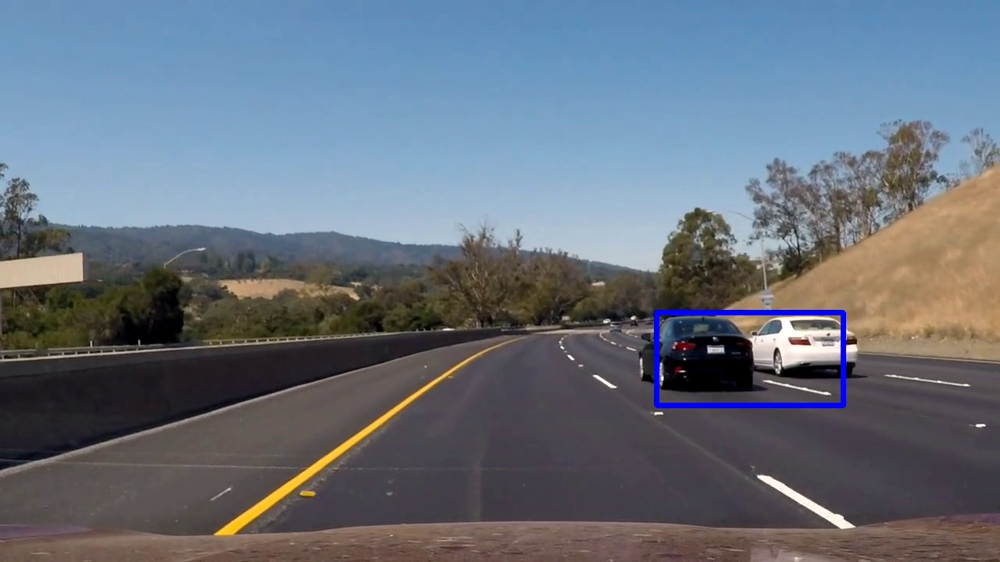
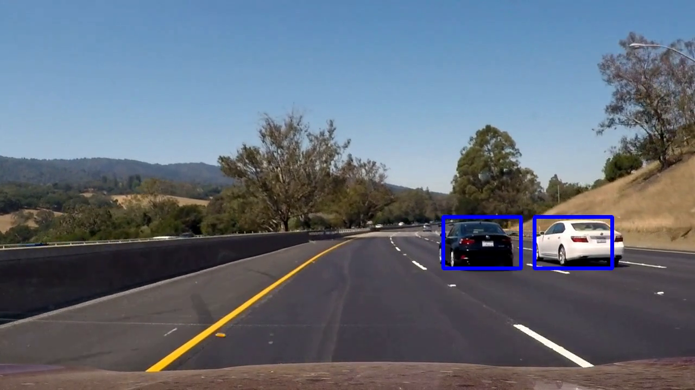

# Vehicle Detection Project

The goals / steps of this project are the following:

* Perform a Histogram of Oriented Gradients (HOG) feature extraction on a labeled training set of images and train a classifier Linear SVM classifier
* Apply a color transform and append binned color features, as well as histograms of color, to the HOG feature vector. 
* Implement a sliding-window technique and use the trained classifier to search for vehicles in images.
* Run the pipeline on a video stream and create a heat map of recurring detections frame by frame to reject outliers and follow detected vehicles.
* Estimate a bounding box for vehicles detected.

## [Rubric](https://review.udacity.com/#!/rubrics/513/view) Points
### Here I will consider the rubric points individually and describe how I addressed each point in my implementation.  

---
### Writeup / README

#### 1. Provide a Writeup / README that includes all the rubric points and how you addressed each one.  You can submit your writeup as markdown or pdf.  [Here](https://github.com/udacity/CarND-Vehicle-Detection/blob/master/writeup_template.md) is a template writeup for this project you can use as a guide and a starting point.  

You're reading it!

### Histogram of Oriented Gradients (HOG)

#### 1. Explain how (and identify where in your code) you extracted HOG features from the training images.


I used all the images that were provided by Udacity which includes the GTI and KITTI dataset. The images are divided into `vehicles` and `non-vehicles` folders. The code for this step is implemented in the `single_img_features` function in `helper_functions.py`:

```python
for file in tqdm(cars):
    img = mpimg.imread(file)

    car_features.append(single_img_features(img,
                                            color_space='YCrCb',
                                            spatial_size=(16, 16),
                                            hist_bins=(16),
                                            orient=9,
                                            pix_per_cell=8,
                                            cell_per_block=2,
                                            hog_channel='ALL',
                                            spatial_feat=True,
                                            hist_feat=True,
                                            hog_feat=True))
```

These are the steps that are applied for a given image:

1. The image is first converted into the selected color space. In the project, all the images are converted to `YCrCb`.

```python
feature_image = cv2.cvtColor(img, cv2.COLOR_RGB2YUV)
```

2. Spatial features are extracted using the `bin_spatial` function.

```python
spatial_features = bin_spatial(feature_image, size=spatial_size)
img_features.append(spatial_features)
```

3. Color histogram features are extracted using the `color_hist` function.

```python
hist_features = color_hist(feature_image, nbins=hist_bins)
img_features.append(hist_features)
```

4. HOG features are extracted. All channels were used. This means that the HOG features of each channel of the image were eventually combined to make up the HOG feature for the image.

```python
hog_features = []
for channel in range(feature_image.shape[2]):
  hog_features.extend(
    get_hog_features(feature_image[:, :, channel],
                     orient, 
                     pix_per_cell, 
                     cell_per_block, 
                     vis=False, 
                     feature_vec=True))

img_features.append(hog_features)
```

5. The spatial, color histogram, and HOG features are all combined. This makes up a single feature vector for this particular image.

![alt text][image1]

I then explored different color spaces and different `skimage.hog()` parameters (`orientations`, `pixels_per_cell`, and `cells_per_block`).  I grabbed random images from each of the two classes and displayed them to get a feel for what the `skimage.hog()` output looks like.

Here is an example using the `YCrCb` color space and HOG parameters of `orientations=8`, `pixels_per_cell=(8, 8)` and `cells_per_block=(2, 2)`:




#### 2. Explain how you settled on your final choice of HOG parameters.

I tried various combinations of parameters and in the end settled for using all the channels of the image in the `YCrCb`. I set the number of orientations to `9`, pixels per cell to `8` and `2` cells per block. 

I found that setting `orient` to a bigger value slowed the algorithm down especially for larger images, and `9` was a good balance of speed and accuracy (when training the SVM).

I also experiemented with a range of color spaces and `YCrCb` gave the best results with respect to lowest false positives and SVM accuracy.

#### 3. Describe how (and identify where in your code) you trained a classifier using your selected HOG features (and color features if you used them).

I trained a linear SVM using `LinearSVC()` providied by the `sklearn.svm` package. First, I created the data set using the features with the `create_dataset` function. I randomly selected 20% of the data to be the test set and the remaining to be the training set:

```python
result = create_dataset(car_features, non_car_features, test_size=0.2)
```

`result` contains the training and test data and labels:

```python
X_train = result['X_train']
X_test = result['X_test']
y_train = result['y_train']
y_test = result['y_test']
X_scaler = result['X_scaler']
```

With this, the SVM can be trained as such with all the extracted features:

```python
svc = LinearSVC()
svc.fit(X_train, y_train)
```

The accuracy of the SVM can be retrieved from the following:

```python
round(svc.score(X_test, y_test), 4)
```

### Sliding Window Search

#### 1. Describe how (and identify where in your code) you implemented a sliding window search.  How did you decide what scales to search and how much to overlap windows?

The sliding window search is implemented in the `find_cars` function:

```python
ystart = 400
ystop = 656
scale = 1.5

out_img, heatmap, rects = find_cars(img,
                                      scale=scale,
                                      ystart=ystart,
                                      ystop=ystop,
                                      pix_per_cell=pix_per_cell,
                                      cell_per_block=cell_per_block,
                                      orient=orient,
                                      spatial_size=spatial_size,
                                      hist_bins=hist_bins,
                                      X_scaler=X_scaler,
                                      svc=svc)
```

The values for `ystart` and `ystop` correspond to the lower half of the image. This cuts down the search by half. I increased the scale by 1.5 since 1.0 was way too small and 1.5 was a good balance to capture vehicles that were slightly further away.

I previously tried to include (and combine) other scales such as 1.0, 2.0, 2.5 and 3.0, but the algorithm ran too slowly and didn't yield any noticeable improvement. Here's a frame that highlights the area searched:



#### 2. Show some examples of test images to demonstrate how your pipeline is working.  What did you do to optimize the performance of your classifier?

Ultimately I searched on only a single scale using YCrCb 3-channel HOG features plus spatially binned color and histograms of color in the feature vector, which provided a nice result. Here are some example images:








### Video Implementation

#### 1. Provide a link to your final video output.  Your pipeline should perform reasonably well on the entire project video (somewhat wobbly or unstable bounding boxes are ok as long as you are identifying the vehicles most of the time with minimal false positives.)

Here's a [link to my video result](./output_video/project_video.mp4)


#### 2. Describe how (and identify where in your code) you implemented some kind of filter for false positives and some method for combining overlapping bounding boxes.

I recorded the heatmaps from each invocation of `find_cars()`. I keep a maximum of 10 heatmaps before discarding the oldest one. Then I compute the average of the heatmaps. The averaged heatmap is then thresholded and used to draw the labeled box:

```python
global heatmaps
global heatmap_sum

heatmaps.append(heatmap)
heatmap_sum += heatmap

if len(heatmaps) > 10:
    oldest_heatmap = heatmaps.pop(0)
    heatmap_sum -= oldest_heatmap
    heatmap_sum = np.clip(heatmap_sum, 0, 255)

heatmap_avg = np.divide(heatmap_sum, len(heatmaps))

heatmap_avg_threshold = apply_threshold(heatmap_avg, 1)
labels = label(heatmap_avg_threshold)
draw_img = draw_labeled_bboxes(np.copy(img), labels)
```

My previous implementation didn't account for any previous heatmaps. This resulted in a bounding box that was less stable - it basically grew or shrank wildly on each frame. This improved implementation of averaging heatmaps gave a much more stable bounding box.

### Here are six frames and their corresponding heatmaps:

![alt text][image5]

### Here is the output of `scipy.ndimage.measurements.label()` on the integrated heatmap from all six frames:
![alt text][image6]

### Here the resulting bounding boxes are drawn onto the last frame in the series:
![alt text][image7]

---

### Discussion

#### 1. Briefly discuss any problems / issues you faced in your implementation of this project.  Where will your pipeline likely fail?  What could you do to make it more robust?

Here I'll talk about the approach I took, what techniques I used, what worked and why, where the pipeline might fail and how I might improve it if I were going to pursue this project further.  

